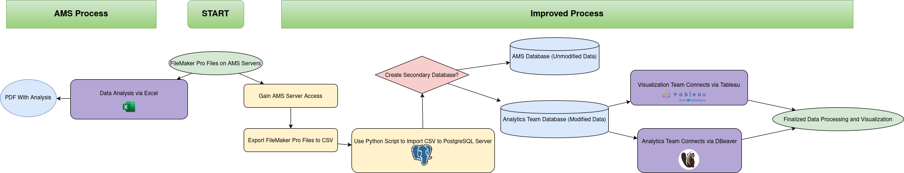

# AMS-Data-Mine

A migration and ETL pipeline to move legacy FileMaker Pro data into PostgreSQL, ingest and consolidate DGdata and EENDR survey CSVs (2010–2015), and maintain automated backups.



## Repository Structure

```
.
├── docker-compose.yml                # Defines Postgres (and optional tunnel) services
├── .env                              # Environment variables (create locally)
├── csv_postgres.py                   # Python script to import CSV files into Postgres
├── clean.py                          # Utility to sanitize CSV column names
├── backup_postgres_single_db.sh      # Backup script for Postgres (docker exec + pg_dump + gzip)
├── sql/                              # SQL scripts for merging survey data
│   ├── merge_dgdata.sql
│   ├── merge_eendr.sql
│   └── merge_surveys.sql
└── README.md                         # This file
```

## Prerequisites

- Docker & Docker Compose
- Python 3.7+
- pip packages:
  ```bash
  pip install pandas psycopg2-binary python-dotenv
  ```
- (Optional) Cloudflare Tunnel token for secure exposure

## 1. Environment Setup

1. Create a file named `.env` at the project root with the following:
   ```ini
   POSTGRES_USER=your_pg_username
   POSTGRES_PASSWORD=your_pg_password
   POSTGRES_DB=your_db_name
   # If using cloudflared tunnel:
   TUNNEL_TOKEN=your_cloudflare_tunnel_token
   ```
2. Start services:
   ```bash
   docker-compose up -d
   ```

This brings up:

- **postgres**: PostgreSQL 15, port 5432
- **cloudflared** (if configured): runs `tunnel run` to expose Postgres

## 2. Migrating FileMaker Pro Data

1. Export each FileMaker Pro table as a CSV file.
2. (Optional) Clean column names to valid SQL identifiers:
   ```bash
   python3 clean.py path/to/input.csv path/to/output.csv
   ```
3. Place your CSV files into the host directory mounted by Docker (default `/home/ams/postgres/csv_files/`).

## 3. Ingesting CSV Data

Run the import script:

```bash
python3 csv_postgres.py
```

What it does:

1. Reads all `.csv` files from `/home/ams/postgres/csv_files/`.
2. Drops entirely empty columns and converts DataFrame types to `INTEGER`, `FLOAT`, or `TEXT`.
3. Creates tables named `survey_data_<filename>` and inserts all rows.
4. Moves processed CSVs to `/home/ams/postgres/csv_files_old/`.

## 4. Merging Survey Data with SQL

Example queries for merging tables:

- **sql/merge_dgdata.sql**
  ```sql
  DROP TABLE IF EXISTS dgdata_merged;
  CREATE TABLE dgdata_merged AS
    SELECT * FROM survey_data_dgdata_2010
    UNION ALL
    SELECT * FROM survey_data_dgdata_2011
    -- ...repeat through 2015...
  ;
  ```

- **sql/merge_eendr.sql**
  ```sql
  DROP TABLE IF EXISTS eendr_merged;
  CREATE TABLE eendr_merged AS
    SELECT * FROM survey_data_eendr_2010
    UNION ALL
    -- ...through 2015...
  ;
  ```

- **sql/merge_surveys.sql**
  ```sql
  DROP TABLE IF EXISTS surveys_final;
  CREATE TABLE surveys_final AS
  SELECT
    COALESCE(d.survey_id, e.survey_id) AS survey_id,
    d.common_field1,
    d.common_field2,
    d.unique_dg_field,
    e.unique_eendr_field
  FROM dgdata_merged d
  FULL OUTER JOIN eendr_merged e
    USING (survey_id, common_field1, common_field2);
  ```

Columns not present in one survey will appear as `NULL`.

Run any merge script with:

```bash
psql -h localhost -U $POSTGRES_USER -d $POSTGRES_DB -f sql/merge_surveys.sql
```

## 5. Automated Backups

Backups are handled by `backup_postgres_single_db.sh`:

```bash
#!/bin/bash
# Load variables
source .env

# Settings
CONTAINER_NAME=postgres
POSTGRES_USER=$POSTGRES_USER
POSTGRES_PASSWORD=$POSTGRES_PASSWORD
POSTGRES_DB=$POSTGRES_DB
BACKUP_DIR=/home/ams/postgres/backups
TIMESTAMP=$(date +"%Y%m%d%H%M%S")
BACKUP_FILE=$BACKUP_DIR/${POSTGRES_DB}_backup_$TIMESTAMP.sql

mkdir -p $BACKUP_DIR

docker exec -e PGPASSWORD=$POSTGRES_PASSWORD -t $CONTAINER_NAME \
  pg_dump -U $POSTGRES_USER $POSTGRES_DB > $BACKUP_FILE

gzip $BACKUP_FILE
# Optional retention:
# find $BACKUP_DIR -type f -name "${POSTGRES_DB}_backup_*.sql.gz" -mtime +7 -delete
```

Schedule daily backups (e.g., at 3 AM) via cron:

```cron
0 3 * * * /path/to/backup_postgres_single_db.sh
```

